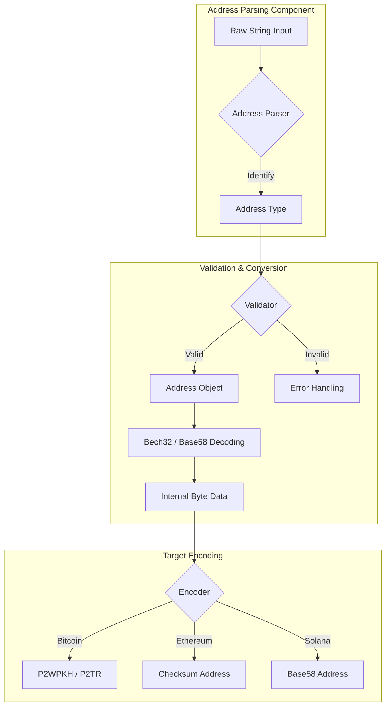
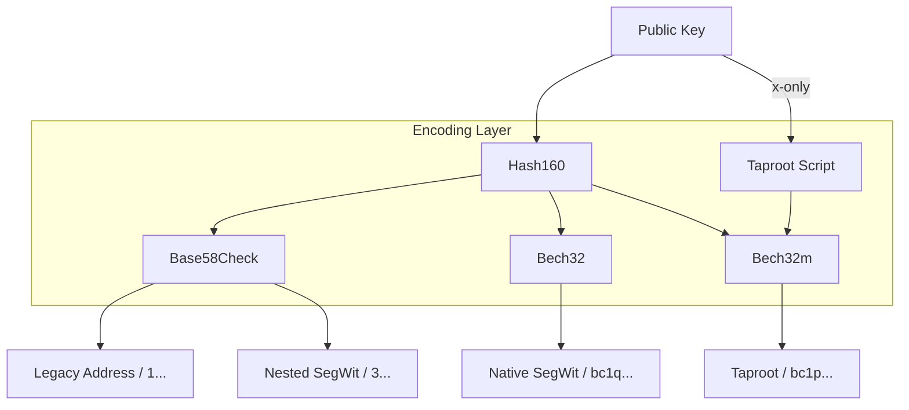

# kotlin-address

<p align="center">
  
</p>

<p align="center">
  <a href="https://jitpack.io/#ImL1s/kotlin-address"></a>
  <a href="#"></a>
  <a href="#"></a>
  <a href="#"></a>
</p>

<p align="center">
  <strong>🌐 Unified Blockchain Address Handling for Kotlin Multiplatform.</strong>
</p>

Pure Kotlin library for robust blockchain address parsing, validation, and conversion across multiple ecosystems.

---

## 🏗️ Architecture



---

## 🏗️ Address Derivation Flow



---

## ✨ Features

- **Multi-Chain Support**: Bitcoin (SegWit, Taproot), Ethereum (EIP-55), Solana, and more.
- **Deep Validation**: Checksum verification, prefix matching, and length validation.
- **Bech32/Bech32m**: Native support for BIP173 and BIP350.
- **Base58Check**: Legacy address support with robust checksumming.
- **Pure Kotlin**: 100% Kotlin code, perfect for KMP and WatchOS.

### Low-Level Encoding

You can usage `Base58` and `Bech32` directly for custom encoding needs:

```kotlin
// Base58Check
val encoded = Base58.encodeCheck(version = 0x00, payload = hash160)
val decoded = Base58.decodeCheck("1A1zP1eP5QGefi2DMPTfTL5SLmv7DivfNa")

// Bech32 (SegWit)
val bech32Address = Bech32.encodeSegwit("bc", 0, witnessProgram)
val decodedBech32 = Bech32.decode("bc1q...")
```

---

## 📦 Installation

```kotlin
// build.gradle.kts
implementation("com.github.ImL1s:kotlin-address:0.3.0-watchos")
```

## 🚀 Usage

### Parse and Validate Bitcoin Address
```kotlin
val address = BitcoinAddress.from("bc1qxy2kgdygjrsqtzq2n0yrf2493p83kkfjhx0wlh")
if (address.isValid) {
    println("Type: ${address.type}") // P2WPKH
    println("PubKey Hash: ${address.hash.toHex()}")
}
```

### Ethereum Checksum Address
```kotlin
val ethAddr = EthereumAddress("0x742d35cc6634c0532925a3b844bc454e4438f44e")
println(ethAddr.toChecksumAddress())
```

---

## 📄 License
MIT License
