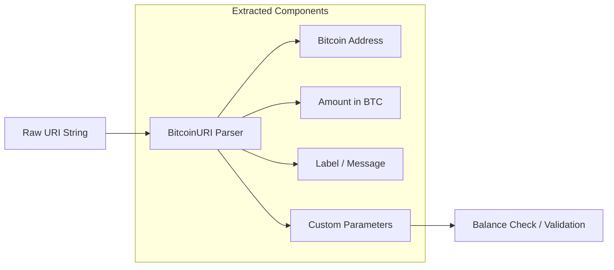

# BIP-21 (Kotlin)

<p align="center">
  
</p>

<p align="center">
  <a href="#"></a>
  <a href="#"></a>
  <a href="LICENSE"></a>
</p>

> [!WARNING]
> This library is not currently production-ready. Use at your own risk.

---

## 🏗️ URI Parsing Flow



---

## Goals

- [x] BIP-0021 compliant
- [x] Well tested
- [ ] Well documented
- [ ] Production ready
- [ ] Usable in KMP projects (JVM and iOS platforms)

## Install

The library is currently deployed to Maven Central's snapshot repository.

```kotlin
// settings.gradle.kts
dependencyResolutionManagement {
    repositories {
        maven("https://s01.oss.sonatype.org/content/repositories/snapshots/")
    }
}
```

```kotlin
// build.gradle.kts
implementation("org.kotlinbitcointools:bip21:0.0.5-SNAPSHOT")
```

## Documentation

You can [find the docs for this library here](https://kotlin-bitcoin-tools.github.io/bip21/index.html).

## Build locally

```shell
./gradlew publishToMavenLocal
```

[BIP-0021]: https://github.com/bitcoin/bips/blob/master/bip-0021.mediawiki
