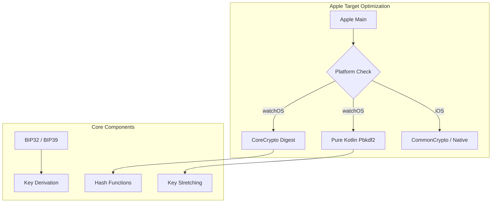
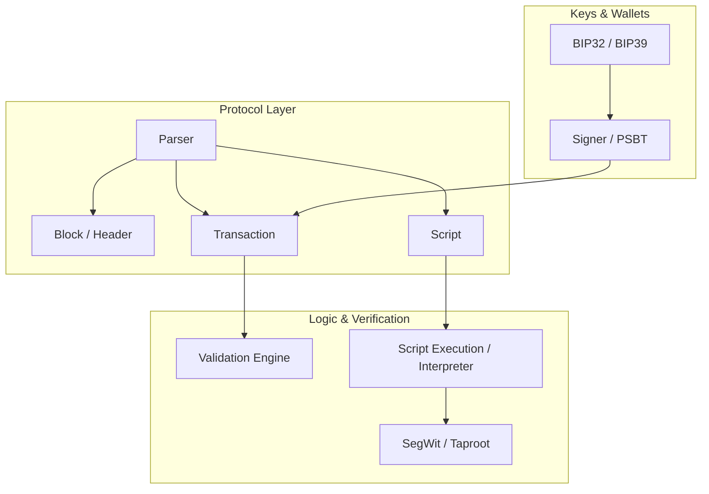

# bitcoin-kmp

<<<<<<< HEAD
> [!IMPORTANT]
> **Fork Information**: This project is forked from [ACINQ/bitcoin-kmp](https://github.com/ACINQ/bitcoin-kmp). It has been modified to support **WatchOS** and **Pure Kotlin Cryptography** for specific platforms.

<p align="center">
  
</p>

<p align="center">
  <a href="https://jitpack.io/#ImL1s/kotlin-bitcoin-kmp"></a>
  <a href="#"></a>
  <a href="#"></a>
  <a href="#"></a>
</p>

<p align="center">
  <strong>₿ Powerful Bitcoin Cryptography library for Kotlin Multiplatform.</strong>
</p>

---

## 🏗️ Architecture



---

## ✨ Features
- **WatchOS Native**: Custom `Digest` and `Pbkdf2` implementations optimized for S-series chips.
- **Full BIP Support**: BIP32, BIP39, BIP44, BIP141 (SegWit).
- **CoreCrypto Integration**: High-performance hashing on Apple platforms via native bindings.
- **Pure Kotlin Fallbacks**: Reliability on platforms with limited native library support.
=======
<p align="center">
  
</p>

<p align="center">
  <a href="#"></a>
  <a href="#"></a>
  <a href="LICENSE"></a>
</p>

<p align="center">
  <strong>🪙 A simple, comprehensive Kotlin Multiplatform implementation of the Bitcoin protocol.</strong>
</p>

---

## 🏗️ Protocol Architecture



---

## ✨ Features

- **Core Primitives**:
  - Base58 / Bech32 / Bech32m encoding & decoding
  - Block, Header, and Transaction parsing/serialization
  - Script parsing and execution (including SegWit, Taproot, OP_CLTV, OP_CSV)
  
- **Transactions**:
  - Construction & Signing (P2PK, P2PKH, P2SH, P2WPKH, P2WSH, **P2TR**)
  - Partial Signing (BIP174 PSBT v0)
  - Full validation logic

- **Wallets & Keys**:
  - BIP 32 (HD Wallets)
  - BIP 39 (Mnemonic Codes)
  - BIP 86 (Taproot Key Derivation)
>>>>>>> d73479b (fix(ci): add google repo and suppress lint)

---

## 📦 Installation

<<<<<<< HEAD
```kotlin
// build.gradle.kts
implementation("com.github.ImL1s:kotlin-bitcoin-kmp:0.14.0-watchos")
```

---

## 📄 License
MIT License
=======
`bitcoin-kmp` is available on Maven Central.

```kotlin
// build.gradle.kts
kotlin {
    sourceSets {
        commonMain.dependencies {
            implementation("fr.acinq.bitcoin:bitcoin-kmp:0.19.0")
        }
    }
}
```

> **Note**: For JVM targets, you must also include a `secp256k1` implementation:
> `implementation("fr.acinq.secp256k1:secp256k1-kmp-jni-jvm:0.14.0")`

---

## 🚀 Usage

### Creating and Signing a Transaction

```kotlin
val privateKey = PrivateKey.fromBase58("cRp4uUnreGMZN8vB7nQFX6XWMHU5Lc73HMAhmcDEwHfbgRS66Cqp", Base58.Prefix.SecretKeyTestnet).first
val publicKey = privateKey.publicKey()
val amount = 1000L.toSatoshi()

// 1. Define inputs and outputs
val tx = Transaction(
    version = 1L,
    txIn = listOf(
        TxIn(OutPoint(previousTx.hash, 0), signatureScript = listOf(), sequence = 0xFFFFFFFFL)
    ),
    txOut = listOf(
        TxOut(
            amount = amount, 
            publicKeyScript = listOf(OP_DUP, OP_HASH160, OP_PUSHDATA(pubkeyHash), OP_EQUALVERIFY, OP_CHECKSIG)
        )
    ),
    lockTime = 0L
)

// 2. Sign inputs
val sig = Transaction.signInput(
    tx, 
    0, 
    previousTx.txOut[0].publicKeyScript, 
    SIGHASH_ALL, 
    privateKey
)

// 3. Update the transaction with the signature
val signedTx = tx.updateSigScript(
    0, 
    listOf(OP_PUSHDATA(sig), OP_PUSHDATA(publicKey))
)

// The transaction is now ready to be broadcast!
```

---

## 🎯 Supported Platforms

| Platform | Support | Notes |
|----------|---------|-------|
| **JVM** | ✅ | Primary development & server target |
| **Android** | ✅ | Full support |
| **iOS** | ✅ | Native support via Kotlin Native |
| **Linux** | ⚠️ | Protoyping/Testing only |

---

## 📄 License

Apache License 2.0
>>>>>>> d73479b (fix(ci): add google repo and suppress lint)
