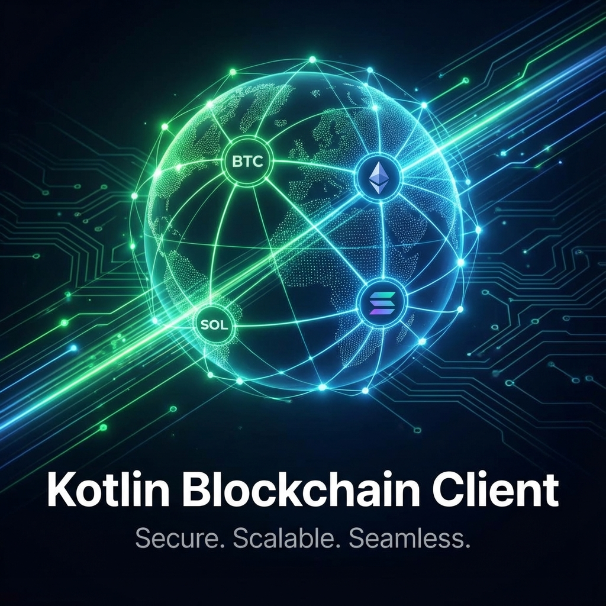
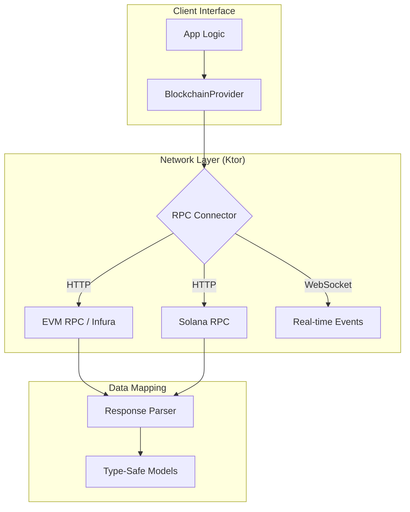

# kotlin-blockchain-client

<p align="center">
  
</p>

<p align="center">
  <a href="https://jitpack.io/#ImL1s/kotlin-blockchain-client"></a>
  <a href="#"></a>
  <a href="#"></a>
  <a href="#"></a>
</p>

<p align="center">
  <strong>📡 Lightweight Koin-friendly Blockchain RPC Client for Kotlin Multiplatform.</strong>
</p>

---

## 🏗️ Architecture



---

## ✨ Features

- **Unified Provider API**: Single interface to interact with multiple chains.
- **Ktor Powered**: Built on top of Ktor for efficient, asynchronous networking.
- **Type-Safe RPC**: Automatic serialization/deserialization of RPC requests and responses.
- **Multilingual Logging**: Integrated with Kermit for cross-platform debugging.
- **Koin Integration**: Ready to be injected into your DI tree.

---

## 📦 Installation

```kotlin
// build.gradle.kts
implementation("com.github.ImL1s:kotlin-blockchain-client:0.4.0-watchos")
```

---

## 🚀 Quick Start

### Initialize Client
```kotlin
val client = EthereumClient(
    rpcUrl = "https://mainnet.infura.io/v3/...",
    chainId = 1
)

val balance = client.getBalance("0x...")
println("Balance: $balance")
```

---

## 📄 License
MIT License
