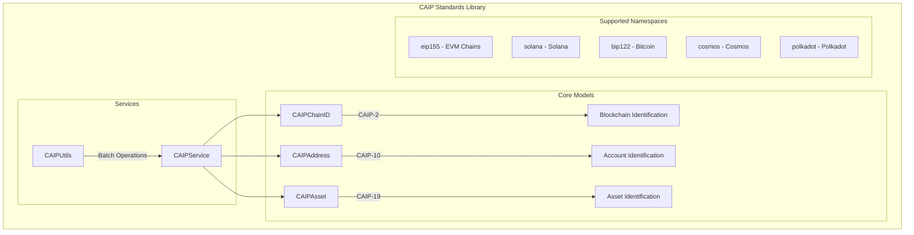

# Kotlin CAIP Standards

<p align="center">
  
</p>

<p align="center">
  <a href="https://jitpack.io/#iml1s/kotlin-caip-standards"></a>
  <a href="#"></a>
  <a href="#"></a>
  <a href="LICENSE"></a>
</p>

<p align="center">
  <strong>🔗 The first complete Kotlin Multiplatform library for blockchain interoperability standards.</strong>
</p>

<p align="center">
  Implementing <a href="https://github.com/ChainAgnostic/CAIPs">CAIP (Chain Agnostic Improvement Proposals)</a><br>
  for seamless cross-chain identification of blockchains, accounts, and assets.
</p>

---

## 🌟 Why CAIP Standards?

Managing multiple blockchains is complex. Each chain has its own address format, asset identification, and chain ID. **CAIP Standards** solve this by providing:

| Problem | CAIP Solution |
|---------|---------------|
| "Which chain is this address from?" | **CAIP-10** → `eip155:1:0xab16...` |
| "How do I identify this blockchain?" | **CAIP-2** → `eip155:1` (Ethereum) |
| "Is this an NFT or token?" | **CAIP-19** → `eip155:1/erc721:0x06...` |

---

## 🏗️ Architecture



---

## ✨ Features

| Feature | Description |
|---------|-------------|
| **CAIP-2** | Identify any blockchain with standard format |
| **CAIP-10** | Universal account identification across chains |
| **CAIP-19** | Identify tokens, NFTs, and native assets |
| **Multi-chain** | Support for 15+ blockchain ecosystems |
| **Type-safe** | Full Kotlin type safety with Result types |
| **Validation** | Built-in address and format validation |

---

## 🎯 Supported Platforms

| Platform | Architectures | Status |
|----------|--------------|--------|
| **Android** | arm64, x64 | ✅ |
| **iOS** | arm64, x64, simulatorArm64 | ✅ |
| **watchOS** | arm32, arm64, x64, simulatorArm64 | ✅ |
| **JVM** | All | ✅ |

---

## 📦 Installation

### Via JitPack (Recommended)

[](https://jitpack.io/#iml1s/kotlin-caip-standards)

```kotlin
// settings.gradle.kts
dependencyResolutionManagement {
    repositories {
        mavenCentral()
        maven { url = uri("https://jitpack.io") }
    }
}

// build.gradle.kts (common source set)
kotlin {
    sourceSets {
        commonMain.dependencies {
            implementation("com.github.iml1s:kotlin-caip-standards:1.0.0")
        }
    }
}
```

---

## 🚀 Quick Start

### CAIP-2: Chain Identification

```kotlin
import io.github.iml1s.caip.model.CAIPChainID

// Parse a CAIP-2 chain ID
val chainId = CAIPChainID.parse("eip155:1").getOrThrow()
println(chainId.namespace)      // "eip155"
println(chainId.reference)      // "1"
println(chainId.getDescription()) // "Ethereum Mainnet"

// Pre-defined chain IDs
val eth = CAIPChainID.ETHEREUM_MAINNET  // "eip155:1"
val sol = CAIPChainID.SOLANA_MAINNET    // "solana:5eykt4UsFv8P8NJdTREpY1vzqKqZKvdp"
val btc = CAIPChainID.BITCOIN_MAINNET   // "bip122:000000000019d6689c085ae165831e93"
```

### CAIP-10: Account Identification

```kotlin
import io.github.iml1s.caip.model.CAIPAddress

// Parse full CAIP-10 address
val address = CAIPAddress.parse("eip155:1:0xab16a96d359ec26a11e2c2b3d8f8b8942d5bfcdb").getOrThrow()
println(address.chainId.toCAIPString()) // "eip155:1"
println(address.address)                 // "0xab16..."

// Create from plain address
val caipAddress = CAIPAddress.fromAddress(
    address = "0xab16a96d359ec26a11e2c2b3d8f8b8942d5bfcdb",
    chainType = CAIPChainType.ETHEREUM
)
println(caipAddress.getDisplayAddress()) // "0xab16...fcdb"
```

### CAIP-19: Asset Identification

```kotlin
import io.github.iml1s.caip.model.CAIPAsset

// Native token
val ethAsset = CAIPAsset.createNativeAsset(CAIPChainType.ETHEREUM)
println(ethAsset.toCAIPString()) // "eip155:1/slip44:60"
println(ethAsset.getSymbol())    // "ETH"

// ERC-20 Token
val usdcAsset = CAIPAsset.createERC20Asset(
    contractAddress = "0xa0b86991c6218b36c1d19d4a2e9eb0ce3606eb48",
    chainType = CAIPChainType.ETHEREUM
)

// NFT
val nftAsset = CAIPAsset.createNFTAsset(
    contractAddress = "0x06012c8cf97bead5deae237070f9587f8e7a266d",
    tokenId = "771769",
    chainType = CAIPChainType.ETHEREUM
)
println(nftAsset.isNFT()) // true
```

---

## 🔗 Supported Chains

| Chain | Namespace | Example Chain ID |
|-------|-----------|------------------|
| Ethereum | eip155 | `eip155:1` |
| Polygon | eip155 | `eip155:137` |
| BSC | eip155 | `eip155:56` |
| Arbitrum | eip155 | `eip155:42161` |
| Optimism | eip155 | `eip155:10` |
| Base | eip155 | `eip155:8453` |
| Avalanche | eip155 | `eip155:43114` |
| Solana | solana | `solana:5eykt4UsFv8P8NJdTREpY1vzqKqZKvdp` |
| Bitcoin | bip122 | `bip122:000000000019d6689c085ae165831e93` |
| Polkadot | polkadot | `polkadot:91b171bb158e2d3848fa23a9f1c25182` |
| Cardano | cardano | `cardano:764824073` |
| TRON | tron | `tron:0x2b6653dc` |

---

## 📊 Supported Asset Types

| Type | Namespace | Example |
|------|-----------|---------|
| Native Token | slip44 | `eip155:1/slip44:60` |
| ERC-20 | erc20 | `eip155:1/erc20:0xa0b8...` |
| ERC-721 NFT | erc721 | `eip155:1/erc721:0x06...` |
| ERC-1155 | erc1155 | `eip155:1/erc1155:0x...` |
| SPL Token | spl-token | `solana:.../spl-token:EPj...` |

---

## 📚 API Reference

| Class | Purpose |
|-------|---------|
| `CAIPChainID` | CAIP-2 chain identification |
| `CAIPAddress` | CAIP-10 account identification |
| `CAIPAsset` | CAIP-19 asset identification |
| `CAIPService` | Unified parsing and conversion |
| `CAIPUtils` | Batch operations and utilities |
| `CAIPChainType` | Chain type enum with metadata |

---

## 🙏 References

- [CAIP-2 Specification](https://github.com/ChainAgnostic/CAIPs/blob/main/CAIPs/caip-2.md)
- [CAIP-10 Specification](https://github.com/ChainAgnostic/CAIPs/blob/main/CAIPs/caip-10.md)
- [CAIP-19 Specification](https://github.com/ChainAgnostic/CAIPs/blob/main/CAIPs/caip-19.md)
- [Chain Agnostic Standards Alliance](https://github.com/ChainAgnostic)

---

## 📄 License

```
Copyright 2024 ImL1s

Licensed under the Apache License, Version 2.0 (the "License");
you may not use this file except in compliance with the License.
You may obtain a copy of the License at

    http://www.apache.org/licenses/LICENSE-2.0
```
