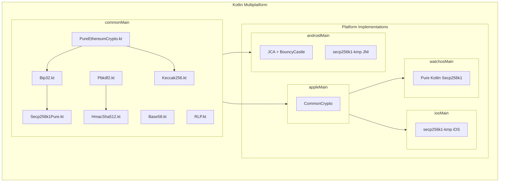
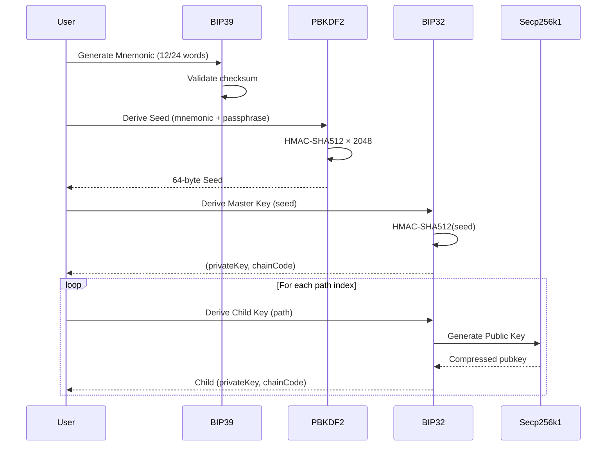

# kotlin-crypto-pure

<p align="center">
  
</p>

<p align="center">
  <a href="#"></a>
  <a href="#"></a>
  <a href="LICENSE"></a>
</p>

<p align="center">
  <strong>🔐 The first complete pure Kotlin cryptography library for wearable wallets.</strong>
</p>

<p align="center">
  A Kotlin Multiplatform library implementing BIP32, BIP39, and secp256k1<br>
  <strong>without any native dependencies</strong>. Designed for watchOS, wearOS, and any Kotlin environment.
</p>

---

## ✨ Features

| Feature | Description |
|---------|-------------|
| **BIP39** | Mnemonic generation, validation, and seed derivation |
| **BIP32** | HD wallet key derivation (both private and public) |
| **Secp256k1** | Pure Kotlin ECDSA signing, verification, and ECDH |
| **BIP340** | Schnorr signatures and Public Key Tweaking (Taproot) |
| **PBKDF2** | HMAC-SHA512 with 2048 iterations (BIP39 compliant) |
| **AES-GCM** | Authenticated encryption |
| **Hashing** | SHA256, SHA512, Keccak256, RIPEMD160 |
| **Encoding** | Base58, Bech32, Bech32m, RLP |
| **Encoding** | Base58, Bech32, Bech32m, RLP |
| **Blockchain**| Solana, Tron, Ethereum, Bitcoin, TON, Ripple (XRP), Polkadot (DOT), Cardano (ADA), Aptos, Sui, Near, Cosmos, Avalanche, **Dash**, **Zcash**, **Monero** |
| **Advanced** | **Sr25519** (Schnorrkel), **MuSig2** (Schnorr Multi-sig), **BIP32-Ed25519** (Khovratovich) |

---

## 🏗️ Architecture



---

## 🔄 Key Derivation Flow



---

## 🎯 Target Platforms

| Platform | Implementation | Status |
|----------|----------------|--------|
| **Android** | JCA + secp256k1-kmp (JNI) | ✅ |
| **iOS** | CommonCrypto + secp256k1-kmp | ✅ |
| **watchOS** | CommonCrypto + Pure Kotlin Secp256k1 | ✅ |
| **wearOS** | Via Android target | ✅ |

---

## 📦 Installation

### Gradle (Kotlin DSL)

```kotlin
// settings.gradle.kts
dependencyResolutionManagement {
    repositories {
        mavenCentral()
    }
}

// build.gradle.kts (common source set)
kotlin {
    sourceSets {
        commonMain.dependencies {
            implementation("io.github.iml1s:kotlin-crypto-pure:1.1.0")
        }
    }
    }
}
```

---

## 🦄 Demo Suite

The repository includes a comprehensive demo suite showcasing real-world usage.

### 💻 CLI Tool
A multi-platform command-line tool to generate wallets.

```bash
# Run on JVM
./gradlew :demo-cli:jvmRun
```

### 📱 Desktop App
A Compose Multiplatform UI application.

```bash
# Run Desktop App
./gradlew :demo-app:desktopRun
```

---

## 🚀 Quick Start

### Generate a Mnemonic & Seed

```kotlin
import io.github.iml1s.crypto.Pbkdf2

// Generate seed from mnemonic (BIP39)
val mnemonic = "abandon abandon abandon abandon abandon abandon abandon abandon abandon abandon abandon about"
val seed = Pbkdf2.bip39Seed(mnemonic, passphrase = "")

// seed is now a 64-byte ByteArray ready for BIP32 derivation
```

### HD Key Derivation (BIP32)

```kotlin
import io.github.iml1s.crypto.Bip32
import io.github.iml1s.crypto.Bip39

// Derive master key from seed
val seed = Bip39.generateSeed(mnemonic, "")
val bip32 = Bip32.create(seed)
val masterKey = bip32.derivePath("m")

// Derive Ethereum account (BIP44)
val ethKey = bip32.derivePath("m/44'/60'/0'/0/0")

// Get private key and chain code
val privateKey = ethKey.privateKey  // 32 bytes
val chainCode = ethKey.chainCode    // 32 bytes
```

### ECDSA Signing (Secp256k1)

```kotlin
import io.github.iml1s.crypto.Secp256k1Pure

// Generate public key from private key
val publicKey = Secp256k1Pure.generatePublicKey(privateKey)

// Sign a message hash (32 bytes)
val signature = Secp256k1Pure.sign(messageHash, privateKey)

// Verify signature
val isValid = Secp256k1Pure.verify(messageHash, signature, publicKey)
```

### Schnorr Signing (BIP340)

```kotlin
// Tweak public key for Taproot (e.g., Q = P + H(P|c)G)
// If merkleRoot is null, it's a key-path spend
val outputKey = Secp256k1Pure.pubKeyTweakAdd(publicKey, tweak)

// Sign using Schnorr
val auxRand = ByteArray(32) // Optional auxiliary entropy
val signature = Secp256k1Pure.schnorrSign(messageHash, privateKey, auxRand)

// Verify Schnorr signature
val isSchnorrValid = Secp256k1Pure.schnorrVerify(signature, messageHash, outputKey)
```

### Ethereum Address Derivation

```kotlin
import io.github.iml1s.crypto.PureEthereumCrypto

// Derive address from private key
val address = PureEthereumCrypto.deriveAddressFromPrivateKey(privateKey)
// Returns: "0x9858EfFD232B4033E47d90003D41EC34EcaEda94"
```

### Solana Address & KeyPair

```kotlin
import io.github.iml1s.crypto.Solana

// Generate new random KeyPair
val keyPair = Solana.generateKeyPair()
val privateKey = keyPair.privateKey // 32 bytes seed
val publicKey = keyPair.publicKey   // 32 bytes

// Get Address (Base58 encoded public key)
val address = Solana.getAddress(publicKey)
```

### Tron Address Generation

```kotlin
import io.github.iml1s.crypto.Tron
import io.github.iml1s.crypto.Secp256k1Pure

// Generate public key first
val publicKey = Secp256k1Pure.generatePublicKey(privateKey)

// Get Tron Address (Base58Check with '41' prefix)
val tronAddress = Tron.getAddress(publicKey)
// Returns: "T..."
```

### TON (The Open Network)

Generate standard Wallet V4R2 address from mnemonic.

```kotlin
import io.github.iml1s.crypto.Ton

// 1. Derive KeyPair from Mnemonic (Ed25519)
val keyPair = Ton.keyPairFromMnemonic("dose ice enrich trigger test fly arrow rub cloud ladder allow clay")

// 2. Generate Wallet Address (V4R2)
val address = Ton.getAddress(
    publicKey = keyPair.publicKey,
    workchain = 0,      // 0 for Mainnet, -1 for Masterchain
    bounceable = true   // UQ... (Non-bounceable) or EQ... (Bounceable)
)
println(address) // EQ...
```

### Ripple (XRP)

```kotlin
import io.github.iml1s.crypto.Xrp

// Generate XRP Address (Base58 with 'r' prefix)
val xrpAddress = Xrp.getAddress(publicKey)
// Returns: "r..."

// Validate Address
val isValid = Xrp.isValidAddress(xrpAddress)
```

### Polkadot (DOT)

```kotlin
import io.github.iml1s.crypto.Polkadot

// Encode Public Key to SS58 Address
// Network 0 = Polkadot (1...), 42 = Substrate (5...)
val dotAddress = Polkadot.encode(publicKey, network = 0)
// Returns: "1..."

// Decode
val (network, pubKey) = Polkadot.decode(dotAddress)
```

### Cardano (ADA)

```kotlin
import io.github.iml1s.crypto.Cardano
import io.github.iml1s.crypto.CardanoNetwork

// Generate Shelley Enterprise Address (addr1...)
val adaAddress = Cardano.address(publicKey, CardanoNetwork.MAINNET)
// Returns: "addr1..."
// Returns: "addr1..."
```

### Cosmos (ATOM)

```kotlin
import io.github.iml1s.crypto.Cosmos

// Generate Bech32 address (cosmos1...)
val atomAddress = Cosmos.getAddress(publicKey, hrp = "cosmos")
// Returns: "cosmos1..."
```

### Avalanche (AVAX)

```kotlin
import io.github.iml1s.crypto.Avalanche

// X-Chain (Bech32)
val xAddress = Avalanche.getXAddress(publicKey)
// Returns: "X-avax1..."

// C-Chain (EVM)
val cAddress = Avalanche.getCAddress(privateKey) // Uses Ethereum logic
// Returns: "0x..."
```

### Near Protocol

```kotlin
import io.github.iml1s.crypto.Near

// Generate Ed25519 Address (Hex)
val nearAddress = Near.getAddress(publicKey)
// Returns: "0612... (64 chars hex)"
```

### Sui

```kotlin
import io.github.iml1s.crypto.Sui

// Generate Blake2b-256 Address
val suiAddress = Sui.getAddress(publicKey)
// Returns: "0x..."
```

### Aptos

```kotlin
import io.github.iml1s.crypto.Aptos

// Generate SHA3-256 Address
val aptosAddress = Aptos.getAddress(publicKey)
// Returns: "0x..."
```

### Sr25519 (Schnorrkel)
Generate keys and sign messages compatible with Polkadot/Substrate.

```kotlin
import io.github.iml1s.crypto.Sr25519

// 1. Generate KeyPair from Seed
val keyPair = Sr25519.keypairFromSeed(seed32Bytes)

// 2. Sign a message
val signature = Sr25519.sign(
    publicKey = keyPair.publicKey,
    secretKey = keyPair.secretKey,
    message = "Hello Substrate".encodeToByteArray(),
    context = "substrate".encodeToByteArray() // Optional context
)

// 3. Verify
val isValid = Sr25519.verify(
    publicKey = keyPair.publicKey,
    message = "Hello Substrate".encodeToByteArray(),
    signature = signature,
    context = "substrate".encodeToByteArray()
)
```

### MuSig2 (Schnorr Multi-Signature)
Aggregate keys and signatures (BIP-327).

```kotlin
import io.github.iml1s.crypto.MuSig2

// 1. Key Aggregation
val pubKeys = listOf(pubKey1, pubKey2, pubKey3)
val aggCtx = MuSig2.aggregateKeys(pubKeys)
val aggPubKey = aggCtx.aggPubKey

// 2. Signing (Round 1)
val secNonce = MuSig2.genNonce()
val pubNonce = secNonce.pubNonce

// ... Exchange public nonces ...

// 3. Signing (Round 2)
val aggNonce = MuSig2.aggregateNonces(listOf(pubNonce1, pubNonce2, pubNonce3))
val partialSig = MuSig2.sign(secKey, secNonce, aggNonce, aggPubKey, message)

// 4. Aggregation & Verification
val finalSig = MuSig2.aggregateSigs(listOf(partialSig1, partialSig2, partialSig3), aggNonce)
val isValid = MuSig2.verify(aggPubKey, message, finalSig)
```

---

## 🛡️ Security

### Verified Against Standard Test Vectors

| Standard | Source | Status |
|----------|--------|--------|
| **BIP39** | Official Trezor vectors | ✅ |
| **BIP32** | Test Vectors 1, 2, 3 | ✅ |
| **Secp256k1** | Wycheproof edge cases | ✅ |
| **RFC 6979** | Deterministic signatures | ✅ |

### Secure Memory Handling

```kotlin
// Automatic cleanup of sensitive data
Secp256k1Pure.sign(message, privateKey)  // k value is securely wiped after use

// SecureByteArray for sensitive data
val secureKey = SecureByteArray.wrap(privateKey)
secureKey.use { key ->
    // Use the key
}  // Automatically wiped when done
```

---

## 📚 API Reference

| Class | Purpose |
|-------|---------|
| `Pbkdf2` | BIP39 seed derivation |
| `Bip32` | HD key derivation |
| `Secp256k1Pure` | ECDSA operations (pure Kotlin) |
| `Secp256k1Provider` | Platform-optimized ECDSA |
| `PureEthereumCrypto` | Ethereum utilities |
| `AesGcm` | Encryption/Decryption |
| `Keccak256` | Ethereum hashing |
| `Base58` | Bitcoin/Solana address encoding |
| `Bech32` | Segwit/Taproot address encoding |
| `Hex` | Unified hex encoding/decoding |
| `Solana` | Solana keypair and address utils |
| `Tron` | Tron address utilities |
| `Ton` | TON address and key utilities |
| `Xrp` | Ripple address utilities |
| `Polkadot` | SS58 encoding/decoding |
| `Cardano` | Shelley address generation |
| `Cosmos` | Bech32 address utilities |
| `Avalanche` | X-Chain and C-Chain utils |
| `Near` | Near Protocol utils |
| `Sui` | Sui address generation |
| `Aptos` | Aptos address generation |
| `Sr25519` | Schnorrkel signing/verification |
| `MuSig2` | Schnorr multi-signature aggregation |
| `Dash` | Dash (DASH) address utilities |
| `Zcash` | Zcash transparent address (t-addr) |
| `Monero` | Monero (XMR) address utilities |
| `MoneroBase58` | Monero-specific Base58 encoding |

---

## 🙏 Acknowledgements

- BIP39/32 specifications from [Bitcoin Improvement Proposals](https://github.com/bitcoin/bips)
- Wycheproof test vectors from [Google Security](https://github.com/google/wycheproof)
- RFC 6979 for deterministic signatures

---

## 📄 License

```
Copyright 2024 ImL1s

Licensed under the Apache License, Version 2.0 (the "License");
you may not use this file except in compliance with the License.
You may obtain a copy of the License at

    http://www.apache.org/licenses/LICENSE-2.0
```
