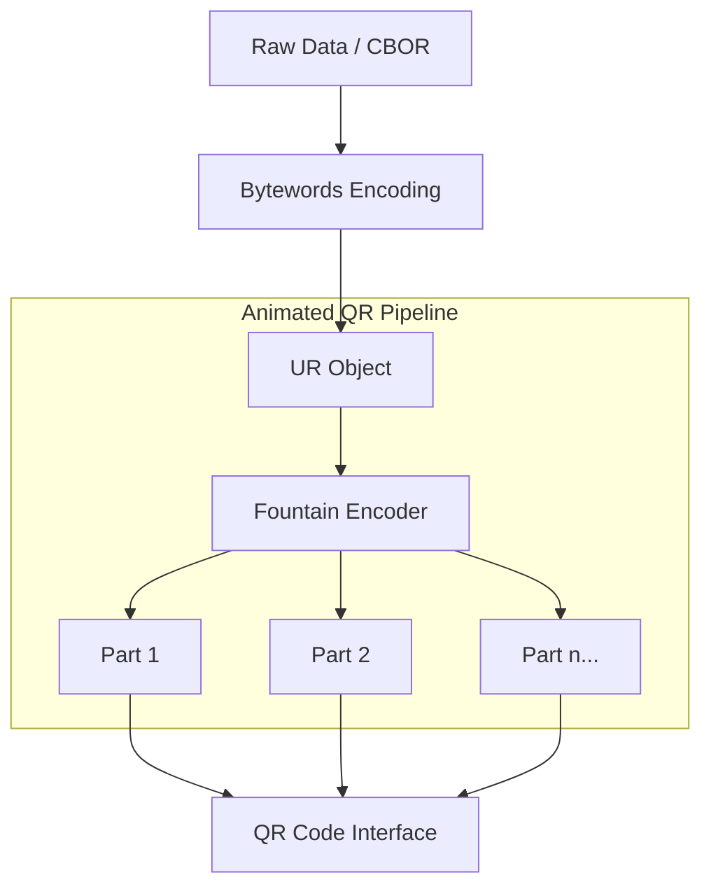

# kotlin-hardware-wallet


[](https://kotlinlang.org/docs/multiplatform.html)
[](LICENSE)

Pure Kotlin implementation of BC-UR (Uniform Resources) for hardware wallet communication.

## Features

- **Pure Kotlin** - No external dependencies, fully KMP compatible
- **Cross-Platform** - Android, iOS, macOS, watchOS, JVM
- **BCR-2020-005 Compliant** - Follows Blockchain Commons UR specification
- **BCR-2020-012 Compliant** - Implements Bytewords encoding
- **Fountain Code** - Supports animated QR codes for large data

## 🏗️ BC-UR Communication Flow



---

## Modules

| Module | Description |
|--------|-------------|
| `UR` | Core Uniform Resource class |
| `UREncoder` | Single/multi-part UR encoding |
| `Bytewords` | BCR-2020-012 byte-to-word encoding |
| `FountainEncoder` | Rateless fountain code encoder |
| `CRC32` | Pure Kotlin CRC32 checksum |
| `SHA256` | Pure Kotlin SHA-256 hash |
| `Xoshiro256StarStar` | Deterministic PRNG for fountain codes |

## Installation

```kotlin
// In your build.gradle.kts
implementation("io.github.iml1s:kotlin-hardware-wallet:1.0.0")
```

## Usage

### Single-Part UR

```kotlin
import io.github.iml1s.bcur.UR
import io.github.iml1s.bcur.UREncoder

// Create a UR with CBOR data
val cborData = byteArrayOf(0xa1.toByte(), 0x01, 0x50, /* ... */)
val ur = UR("seed", cborData)

// Encode as UR string
val urString = UREncoder.encode(ur)
// Result: ur:seed/oyadgdstaslplabghydrpfmkbggufgludprfgmamdp...

// Parse a UR string
val parsedUr = UR.parse(urString)
```

### Multi-Part UR (Animated QR)

```kotlin
import io.github.iml1s.bcur.UR
import io.github.iml1s.bcur.UREncoder

val largeData = ByteArray(1000) { it.toByte() }
val ur = UR("bytes", largeData)

// Create encoder with fragment size limits
val encoder = UREncoder(ur, maxFragmentLen = 100, minFragmentLen = 10)

// Generate parts for animated QR code
while (!encoder.isComplete()) {
    val part = encoder.nextPart()
    // Display QR code for: part
    // e.g., ur:bytes/1-10/lpadaxcsencylobemohsgmoyadhdeynteelbl...
}
```

## Specifications

- [BCR-2020-005: Uniform Resources (UR)](https://github.com/BlockchainCommons/Research/blob/master/papers/bcr-2020-005-ur.md)
- [BCR-2020-012: Bytewords](https://github.com/BlockchainCommons/Research/blob/master/papers/bcr-2020-012-bytewords.md)
- [BCR-2024-001: Multipart UR (MUR)](https://github.com/BlockchainCommons/Research/blob/master/papers/bcr-2024-001-multipart-ur.md)

## References

This library is ported from:
- [sparrowwallet/hummingbird](https://github.com/sparrowwallet/hummingbird) (Java)
- [BlockchainCommons/URKit](https://github.com/BlockchainCommons/URKit) (Swift)

## License

MIT License
