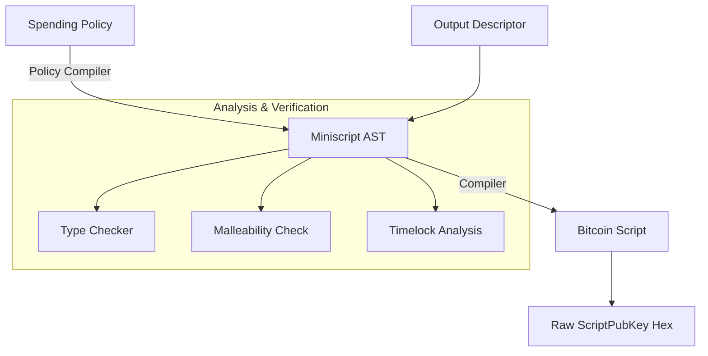

# Kotlin Miniscript


A pure Kotlin Multiplatform implementation of **Bitcoin Miniscript**, allowing for structured, analyzable, and composable Bitcoin Scripts. This library supports parsing, compilation, type checking, and Output Descriptors (BIP 380-386).

## 🏗️ Architecture & Flow



---

## 🚀 Features

- **Miniscript AST**: Full implementation of the Miniscript language structure.
- **Policy Compiler**: Compile high-level policies (e.g., `and(pk(A), or(pk(B), older(10)))`) into optimized Miniscript.
- **Output Descriptors**:
  - Full support for standard descriptors: `pkh`, `wpkh`, `sh`, `wsh`, `multi`, etc.
  - **Taproot Support**: `tr(KEY)` and `tr(KEY, TREE)` with full script tree support (BIP-341).
  - **Address Support**: `addr(ADDRESS)` for legacy, SegWit, and Taproot addresses.
- **Analysis**:
  - **Correctness**: Static analysis of script correctness.
  - **Malleability**: Detection of malleable script constructions.
  - **Timelocks**: Analysis of relative and absolute timelock requirements.
- **Cross-Platform**: Built with Kotlin Multiplatform (currently verified on JVM).

## 📦 Installation

Add the dependency to your `build.gradle.kts`:

```kotlin
sourceSets {
    commonMain.dependencies {
        implementation("io.github.iml1s:kotlin-miniscript:0.1.0")
    }
}
```

## 💻 Usage

### 1. Parsing and Compiling Miniscript

Parse a Miniscript string and compile it to a Bitcoin Script:

```kotlin
val miniscript = "and_v(v:pk(A),pk(B))"
val node = MiniscriptParser.parse(miniscript)

// Verify properties
println("Is Valid: ${node.isValid}")
println("Script Size: ${node.scriptSize}")

// Compile to Script
val script: List<ScriptElt> = node.compile()
val hex = Hex.encode(Descriptor.scriptToBytes(script))
println("Script Hex: $hex")
```

### 2. Policy Compilation

Express spending conditions in high-level Policy language and compile them to Miniscript:

```kotlin
// Policy: "Alice signs" AND ("Bob signs" OR "Wait 10 blocks")
val policyCtx = "and(pk(A),or(pk(B),older(10)))"
val policy = PolicyParser.parse(policyCtx)

// Compile to Miniscript
val miniscript = policy.compileToMiniscript()
println("Miniscript: $miniscript")
```

### 3. Output Descriptors

Parse standard Bitcoin Output Descriptors, including complex Taproot trees:

```kotlin
// Taproot with Script Tree
// Spend path: Key Path (InternalKey) OR Script Path (Leaf A or Leaf B)
val descriptor = "tr(c6047f9...,{pk(A),pk(B)})"

val desc = DescriptorParser.parse<StringKey>(descriptor, BareCtx)
if (desc is Descriptor.Tr) {
    println("Internal Key: ${desc.internalKey}")
    println("Has Tree: ${desc.tree != null}")
    
    // Generate scriptPubKey (includes tweaking)
    val spk = desc.scriptPubKey()
    println("scriptPubKey: ${Hex.encode(Descriptor.scriptToBytes(spk))}")
}
```

### 4. Address Descriptors

Easily convert addresses to their scriptPubKey representation using `addr()`:

```kotlin
val addrDesc = "addr(bc1qXY...)"
val desc = DescriptorParser.parse<StringKey>(addrDesc, BareCtx)

val script = desc.scriptPubKey()
// Returns appropriate P2WPKH, P2TR, or Legacy script
```

## 🛠 Project Structure

- `io.github.iml1s.miniscript.node`: AST nodes (`Terminal`, `And`, `Or`, etc.).
- `io.github.iml1s.miniscript.policy`: Policy language parser and compiler.
- `io.github.iml1s.miniscript.parser`: Recursive descent parsers for Miniscript and Descriptors.
- `io.github.iml1s.miniscript.types`: Type system (`Correctness`, `Malleability`).

## 📄 License

This project is licensed under the MIT License.
