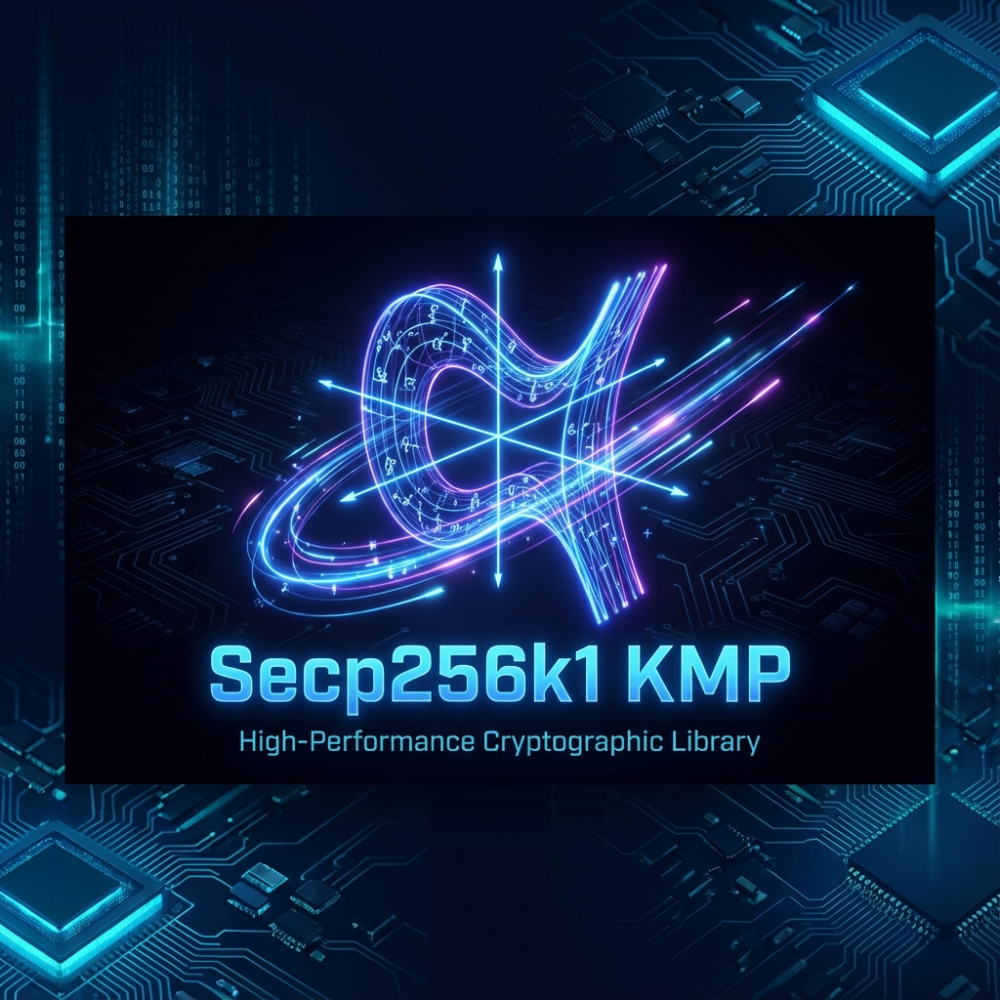
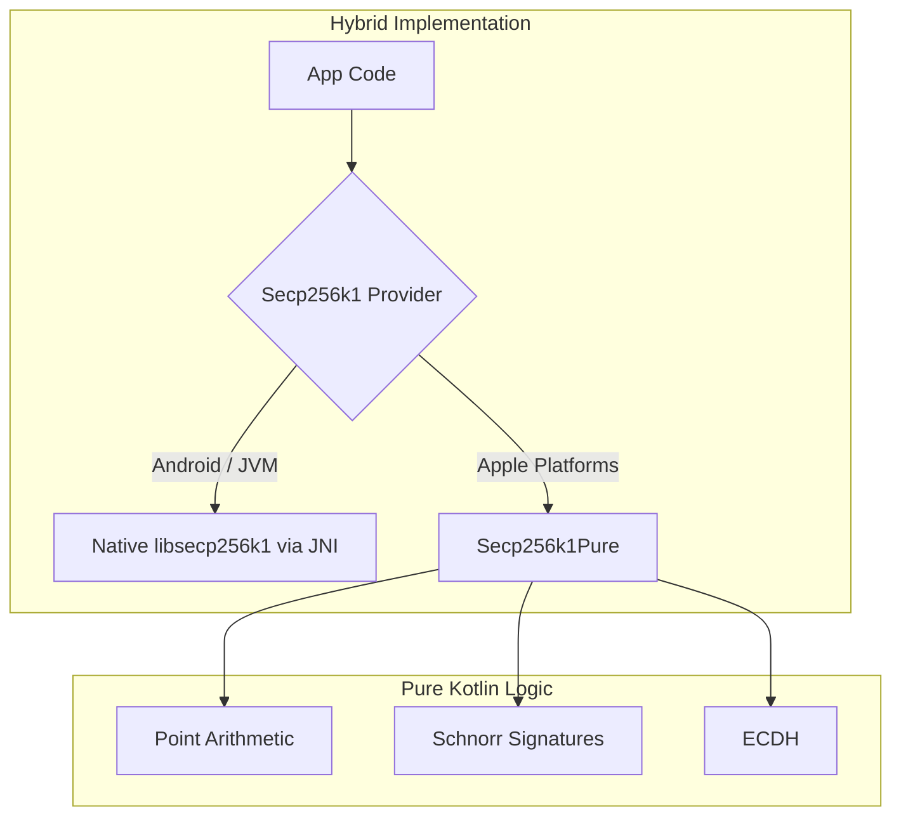

# secp256k1-kmp

> [!IMPORTANT]
> **Fork Information**: This project is forked from [ACINQ/secp256k1-kmp](https://github.com/ACINQ/secp256k1-kmp). It features a **Pure Kotlin** implementation for Apple platforms (iOS/WatchOS) to ensure full compatibility without native C-library dependencies.

<p align="center">
  
</p>

<p align="center">
  <a href="https://jitpack.io/#ImL1s/kotlin-secp256k1-kmp"></a>
  <a href="#"></a>
  <a href="#"></a>
  <a href="#"></a>
</p>

<p align="center">
  <strong>⚡ High-Performance Secp256k1 Cryptography for all platforms.</strong>
</p>

---

## 🏗️ Architecture



---

## ✨ Features
- **Pure Kotlin for Apple**: Completely eliminates the need for complex C-interop on iOS and WatchOS.
- **Schnorr Support**: Full BIP340 implementation.
- **JNI for Speed**: Uses original C library on Android/JVM for maximum performance.
- **Unified API**: Identical interface regardless of the underlying implementation.

---

## 📦 Installation

```kotlin
// build.gradle.kts
implementation("com.github.ImL1s:kotlin-secp256k1-kmp:0.23.0-watchos")
```

---

## 📄 License
MIT License
