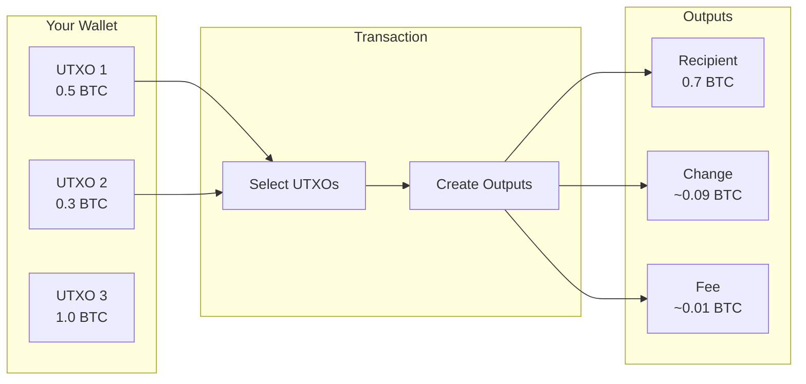
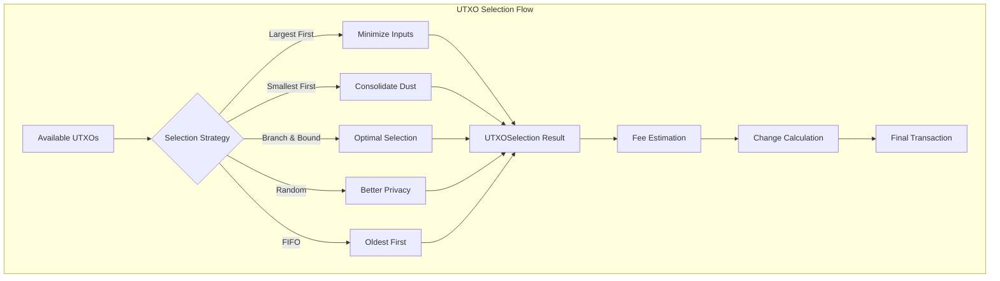

# kotlin-utxo

<p align="center">
  
</p>

<p align="center">
  <a href="https://jitpack.io/#iml1s/kotlin-utxo"></a>
  <a href="#"></a>
  <a href="#"></a>
  <a href="LICENSE"></a>
</p>

<p align="center">
  <strong>₿ Pure Kotlin UTXO management for Bitcoin and UTXO-based blockchains.</strong>
</p>

<p align="center">
  Optimal coin selection, fee estimation, and transaction building<br>
  designed for <strong>wearables</strong> and mobile.
</p>

---

## 🪙 What is UTXO?

Unlike account-based systems (Ethereum), Bitcoin uses the **UTXO (Unspent Transaction Output)** model:



This library handles the complexity of UTXO selection automatically.

---

## ✨ Features

| Feature | Description |
|---------|-------------|
| **5 Selection Strategies** | BnB (Zero-change optimization), Largest-first, Smallest-first, Random, FIFO |
| **Accurate Fee Estimation** | Virtual byte calculation for SegWit |
| **Dust Protection** | Automatic filtering of uneconomical UTXOs |
| **Confirmation Control** | Filter by confirmation count |
| **Pure Kotlin** | No native dependencies |
| **Wearable-Ready** | Optimized for watchOS and Wear OS |

---

## 🏗️ Architecture



---

## 🎯 Supported Platforms

| Platform | Target | Status |
|----------|--------|--------|
| **Android** | `androidTarget` | ✅ |
| **iOS** | `iosArm64`, `iosSimulatorArm64`, `iosX64` | ✅ |
| **watchOS** | `watchosArm64`, `watchosSimulatorArm64` | ✅ |
| **JVM** | `jvm` | ✅ |

---

## 📦 Installation

### Via JitPack (Recommended)

[](https://jitpack.io/#iml1s/kotlin-utxo)

```kotlin
// settings.gradle.kts
dependencyResolutionManagement {
    repositories {
        mavenCentral()
        maven { url = uri("https://jitpack.io") }
    }
}

// build.gradle.kts
kotlin {
    sourceSets {
        commonMain.dependencies {
            implementation("com.github.iml1s:kotlin-utxo:1.0.0")
        }
    }
}
```

---

## 🚀 Quick Start

### Basic UTXO Selection

```kotlin
import io.github.iml1s.utxo.*

// Create available UTXOs
val utxos = listOf(
    UTXO(txid = "abc123...", vout = 0, value = 50_000, confirmed = true),
    UTXO(txid = "def456...", vout = 1, value = 30_000, confirmed = true),
    UTXO(txid = "ghi789...", vout = 0, value = 100_000, confirmed = true)
)

// Select UTXOs for transaction
val selector = UTXOSelector()
val selection = selector.select(
    utxos = utxos,
    targetAmount = 70_000,  // satoshis
    feeRate = 10            // sat/vB
)

println("Selected: ${selection.inputCount} UTXOs")
println("Total: ${selection.totalValue} sats")
println("Change: ${selection.change} sats")
println("Fee: ${selection.estimatedFee} sats")
```

### Selection Strategies

```kotlin
// 🎯 Branch & Bound (Recommended) - Finds Zero-Change combination if possible
selector.select(utxos, 50_000, 10, strategy = UTXOSelectionStrategy.BRANCH_AND_BOUND)

// 📏 Largest First - Minimize inputs
selector.select(utxos, 50_000, 10, strategy = UTXOSelectionStrategy.LARGEST_FIRST)

// 🧹 Smallest First - Consolidate dust
selector.select(utxos, 50_000, 10, strategy = UTXOSelectionStrategy.SMALLEST_FIRST)

// 🎲 Random - Better privacy
selector.select(utxos, 50_000, 10, strategy = UTXOSelectionStrategy.RANDOM)

// 🔄 FIFO - Age-based
selector.select(utxos, 50_000, 10, strategy = UTXOSelectionStrategy.FIFO)
```

### Fee Estimation

```kotlin
// Simple estimation
val fee = FeeEstimator.estimateFeeSimple(
    inputCount = 2,
    outputCount = 2,
    feeRate = 10,
    scriptType = ScriptType.P2WPKH
)

// Fee priority levels
val rates = FeeRates(
    economy = 1,    // ~24 hours
    low = 2,        // ~6 hours
    medium = 5,     // ~1 hour
    high = 10,      // ~30 minutes
    urgent = 20     // Next block
)
```

---

## ⚙️ Configuration

```kotlin
val config = UTXOSelectionConfig(
    strategy = UTXOSelectionStrategy.BRANCH_AND_BOUND,
    dustThreshold = 546L,       // Minimum UTXO value
    includeUnconfirmed = false, // Only confirmed UTXOs
    maxInputs = 100,            // Maximum inputs
    minConfirmations = 1,       // Required confirmations
    maxBranchAndBoundTries = 100_000 // Limit search depth
)

val selector = UTXOSelector(config)

// Pre-defined configurations
val lowFee = UTXOSelector(UTXOSelectionConfig.lowFee())
val consolidate = UTXOSelector(UTXOSelectionConfig.consolidate())
val privacy = UTXOSelector(UTXOSelectionConfig.privacy())
```

---

## 📊 Script Types

| Type | Description | Address Prefix |
|------|-------------|----------------|
| `P2PKH` | Legacy | `1...` |
| `P2SH` | Script Hash | `3...` |
| `P2WPKH` | Native SegWit | `bc1q...` |
| `P2WSH` | Witness Script Hash | `bc1q...` |
| `P2TR` | Taproot | `bc1p...` |

---

## 📚 API Reference

| Class | Purpose |
|-------|---------|
| `UTXO` | Unspent transaction output model |
| `UTXOSelection` | Selection result |
| `UTXOSelector` | Main selection class |
| `UTXOSelectionConfig` | Configuration options |
| `FeeEstimator` | Fee calculation utilities |
| `FeeRates` | Fee priority levels |

---

## 📄 License

```
Copyright 2024 ImL1s

Licensed under the Apache License, Version 2.0 (the "License");
you may not use this file except in compliance with the License.
You may obtain a copy of the License at

    http://www.apache.org/licenses/LICENSE-2.0
```
